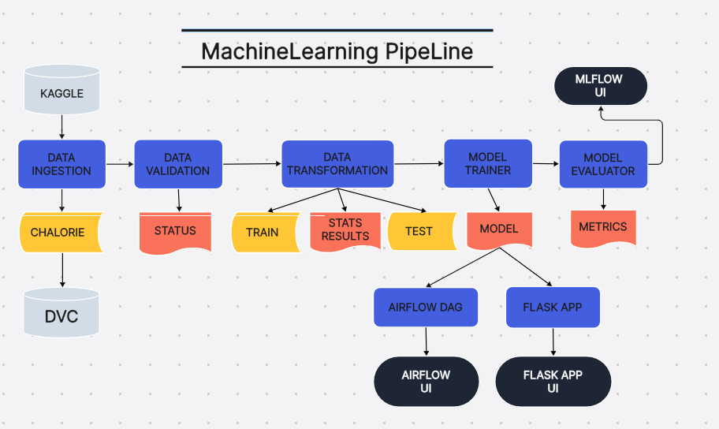
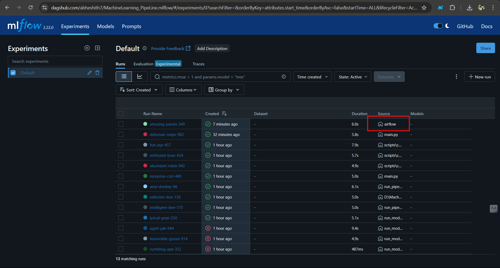
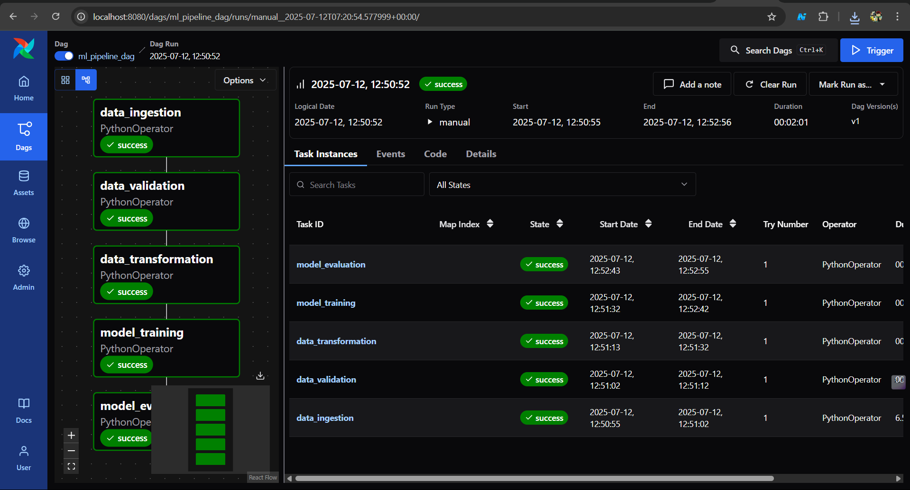
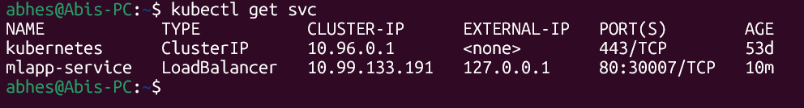

<div align="center">

# MACHINE LEARNING PIPELINE


## Built with the tools and technologies:


</div>

---


<div align="center">

</div>

---

## 🚀 **Workflow Overview**

This machine learning pipeline automates the complete data science workflow from raw data to production-ready models.

• `Data Fetching from Kaggle` - Retrieves datasets from Kaggle platform for training purposes
  Seamlessly connects to Kaggle API to download and access high-quality datasets for machine learning projects.

• `Data Ingestion` - Loads and processes raw data into the pipeline infrastructure
  Efficiently handles multiple data formats and sources with robust error handling and validation mechanisms.

• `Data Validation` - Ensures data quality, completeness, and schema compliance
  Performs comprehensive data integrity checks and identifies missing values, outliers, and data inconsistencies.

• `Data Transformation` - Performs feature engineering, preprocessing, and statistical tests
  Applies scaling, encoding, feature selection, and statistical analysis to prepare data for optimal model performance.

• `Model Training` - Trains machine learning models using processed data
  Implements various algorithms with hyperparameter tuning and cross-validation for robust model development.

• `Model Evaluation` - Assesses model performance and validates results
  Generates detailed performance metrics, confusion matrices, and validation reports to ensure model reliability.

• `MLflow Tracking` - Monitors experiments, parameters, and model versions
  Tracks all experiment runs, logs parameters, metrics, and artifacts for complete experiment management and reproducibility.

• `DVC Integration` - Manages data versioning and pipeline reproducibility
  Maintains version control for datasets and models, enabling collaborative development and pipeline reproducibility.

• `Apache Airflow Orchestration` - Automates and schedules the entire pipeline workflow
  Provides robust workflow scheduling, dependency management, and monitoring with automated retry mechanisms and alerting.

---

## 🛠️ **Implementation Instructions**

### **Running the Pipeline**
Execute the complete machine learning pipeline with a single command:

```bash
python run main.py
```

This command initiates the entire workflow, processing data through all stages from ingestion to model evaluation.

### **Verifying Pipeline Output**
Navigate to the `artifacts` folder to examine the output of each pipeline stage:

```bash
cd artifacts
```

**Stage-wise Outputs:**
- **`data_ingestion/`** - Contains the ingested training dataset
- **`data_validation/`** - Validation status and reports
- **`data_transformation/`** - Transformed datasets and statistical test results
- **`model_trainer/`** - Trained model files and parameters
- **`model_evaluation/`** - Performance metrics and evaluation reports

### **Model Tracking & Monitoring**
Track all experiments, parameters, and model versions through **DagsHub MLflow Integration**:

🔗 **[View Model Tracking Dashboard](https://dagshub.com/abheshith7/MachineLearning_PipeLine.mlflow/#/experiments/0?searchFilter=&orderByKey=attributes.start_time&orderByAsc=false&startTime=ALL&lifecycleFilter=Active&modelVersionFilter=All+Runs&datasetsFilter=W10%3D)**

Monitor experiment runs, compare model performance, and access detailed logging information for complete pipeline transparency.

### **MLflow Tracking Interface**

<div align="center">

</div>

---

## ⚡ **Apache Airflow Pipeline Setup**

### **Prerequisites**
> **Note:** Apache Airflow requires Linux-based systems for optimal performance. Windows users should use WSL or Linux environment.

### **Environment Setup**

#### **1. Copy Project to Linux Environment (Windows Users)**
```bash
cp -r /mnt/d/MachineLearning-PipeLine ~/
```

#### **2. Install Python and Setup Virtual Environment**
```bash
# Install Python3 if not already installed
sudo apt update
sudo apt install python3 python3-pip python3-venv

# Navigate to project directory
cd ~/MachineLearning-PipeLine

# Create virtual environment
python3 -m venv venv

# Activate virtual environment
source venv/bin/activate

# Install dependencies
pip install -r requirements.txt
```

#### **3. Configure Apache Airflow**
```bash
# Set Airflow home directory
export AIRFLOW_HOME=~/airflow
echo $AIRFLOW_HOME

# Configure Airflow settings
vim ~/airflow/airflow.cfg

-> insert - i
Replace "auth_manager = airflow.api_fastapi.auth.managers.simple.simple_auth_manager.SimpleAuthManager" in airflow.cfg file
with "auth_manager=airflow.providers.fab.auth_manager.fab_auth_manager.FabAuthManager".
After Updation press- > esc -> :wq!

# Create DAGs directory
mkdir -p ~/airflow/dags

# Copy DAG file to Airflow directory
cp model_dag.py ~/airflow/dags/

# Test DAG configuration
python ~/airflow/dags/model_dag.py
```

#### **4. Launch Airflow Webserver**
```bash
# Start Airflow standalone mode
airflow standalone
```

#### **5. Execute Pipeline**
1. Open your web browser and navigate to: **http://0.0.0.0:8080**
2. Search for `ml_pipeline_dag` in the DAGs list
3. Click on the DAG and trigger the pipeline execution
4. Monitor the workflow progress through the Airflow UI

### **Airflow Dashboard Interface**

<div align="center">

</div>

---

## 🚀 **CI/CD Pipeline & Deployment**

### **Automated Build & Delivery**
The pipeline triggers automatically based on code changes and performs the following actions:
- **Build** - Creates Docker images from the application code
- **Scan** - Performs security and vulnerability scans on the built images
- **Deliver** - Pushes the validated images to DockerHub registry

### **Kubernetes Deployment Local**

#### **1. Start Minikube Cluster**
```bash
# Initialize Minikube cluster
minikube start
```

#### **2. Deploy Application**
```bash
# Deploy the application using deployment manifest
kubectl apply -f deployment.yaml

# Check pod status
kubectl get pods
```

#### **3. Deploy Services**
```bash
# Apply service configuration
kubectl apply -f service.yaml

# Verify service deployment
kubectl get svc
```

#### **4. Access Application - Method 1 (Port Forwarding)**
```bash
# Forward service port to local machine
kubectl port-forward svc/mlapp-service 8000:80

# Access application in browser
# Navigate to: http://localhost:8000
```

#### **5. Access Application - Method 2 (Load Balancer)**
```bash
# Edit service configuration
kubectl edit svc mlapp-service

# Change service type from 
NodePort to LoadBalancer

esc - :wq! - enter
# Save and exit the editor

# Open new terminal and create tunnel
minikube tunnel

# In original terminal, check for external IP
kubectl get svc

# Access application using external IP in browser
127.0.0.1
```
<div align="center">

</div>

#### **6. Configuring Ingress - (Optional)**
```bash
# Deploy the ingress.yaml file
kubectl apply -f ingress.yaml

# Install the Ingress Controller (nginx)
minikube addons enable ingress

# Check the downloaded Ingress
kubectl get pods -A | grep nginx

# Check Ingress is Deployed
kubectl get ingress # A Address is Being Updated like -> 192.168.49.2

# for setup local system configuraton
sudo vim /etc/hosts

# Add
127.0.0.1       localhost
127.0.1.1       Abis-PC.        Abis-PC
192.168.49.2    foo.bar.com
esc - :wq!

# Check Upadted or not
ping foo.bar.com

# then go to browser
http://foo.bar.com/demo
http://foo.bar.com/admin

```


---

## 🎯 **Conclusion**

This comprehensive machine learning pipeline demonstrates a complete end-to-end MLOps implementation that transforms raw data into production-ready predictive models. The project successfully integrates modern data science practices with robust automation and deployment capabilities.

**Key Achievements:**

• **Automated Workflow** - Seamlessly orchestrates data ingestion, validation, transformation, model training, and evaluation through Apache Airflow, reducing manual intervention and ensuring consistent pipeline execution.

• **Comprehensive Tracking** - Implements MLflow and DVC integration for complete experiment tracking, model versioning, and data lineage management, enabling reproducible research and collaborative development.

• **Production-Ready Deployment** - Provides containerized deployment through Docker and Kubernetes with CI/CD pipeline integration, ensuring scalable and maintainable model serving capabilities.

• **Quality Assurance** - Incorporates rigorous data validation, statistical testing, and model evaluation frameworks that guarantee reliable and trustworthy machine learning outcomes.

• **Modern MLOps Practices** - Leverages industry-standard tools and methodologies including automated testing, version control, monitoring, and deployment strategies for enterprise-grade machine learning solutions.

This pipeline serves as a robust foundation for data science teams looking to implement scalable, maintainable, and production-ready machine learning workflows.

---

<div align="center">
<b>⭐ Star this repository if you found it helpful!</b>
</div>
